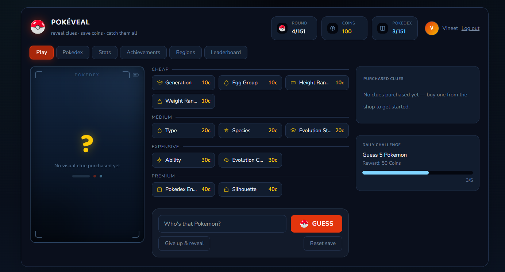

# PokeVeal

Reveal clues. Save coins. Catch them all.

**🎮 Play it live: [pokeveal.vercel.app](https://pokeveal.vercel.app/)**

<p align="center">
  
</p>

A Pokémon guessing game: each round you get a coin budget, and you choose
which clues to buy (cheap / medium / expensive / premium) before guessing
the Pokémon. Wrong guesses cost nothing — only clues do. Your score for a
round is whatever coins you have left when you guess correctly. Give up and
the answer is revealed for free (worth 0 points), and the Pokémon still
gets added to your Pokédex. This ships the full Kanto region (151 Pokémon,
each appearing once per playthrough), with a coin-based clue shop, account
login, a global leaderboard, daily challenges, trainer profiles, Pokédex
tracking, stats, achievements, and a save system so you can close the
browser and pick up where you left off.

## What's included

- **Kanto region** (151 Pokémon), one appearance each per playthrough
- **Coin budget per round**: 100 (rounds 1–25) → 90 (26–50) → 80 (51–75) →
  60 (76–100) → 50 (101–151)
- **Clue shop**: Generation, Egg Group, Height Range, Weight Range (cheap) /
  Type, Species, Evolution Stage (medium) / Ability, Evolution Chain
  (expensive) / Pokédex Entry, Silhouette (premium)
- **No penalty for wrong guesses** — guesses are free, only clues cost coins,
  and close guesses (real Pokémon, wrong answer) get hot/cold feedback on
  type match, generation match, and weight similarity
- **Accounts**: username/password login (JWT-based), so your save follows
  you rather than living only in one browser
- **Global leaderboard**, sortable by total score, best single-round score,
  Pokédex completion %, or total Pokémon caught
- **Daily challenge**: a small daily goal (catch a target number of Pokémon)
  with a coin reward, reset every day
- **Trainer card / profile** for your account
- **Pokédex progress tracking**, stats (score, coins spent, best round,
  fastest guess, most-used clue, current/best streak, etc.), and a handful
  of achievements (First Catch, Getting the Hang of It, Serious Collector,
  Pure Instinct, Sharp Eye, Kanto Champion)
- **Region-unlock screen** — Johto and beyond are shown as locked /
  "coming soon" (data for other regions isn't bundled yet, see
  "What's not included")
- **Save system**: your game state is tied to your account and stored
  server-side in SQLite, so it follows you across devices/browsers as long
  as you're logged in

## What's not included (ideas for later)

Only Kanto has data bundled right now — Johto, Hoenn, Sinnoh, Unova, Kalos,
Alola, Galar, and Paldea are all defined in the region list and shown in the
UI, but locked, since their Pokémon data isn't included in this build.
Multiplayer/head-to-head modes aren't built either.

## Tech stack

- **Backend**: Python + FastAPI, SQLite for accounts and save data, JWT auth
- **Frontend**: React + Vite + Tailwind (`frontend-react/`)
- **Data**: Pokémon names/types/stats/descriptions/evolutions/abilities for
  Gen 1 are bundled locally in `backend/data/pokemon_kanto.json` (sourced
  from the open-source Purukitto/pokemon-data.json dataset). Sprite images
  are loaded from that same GitHub repo at runtime, so you'll need an
  internet connection to see Pokémon art (everything else works offline).

## Requirements

- Python 3.10+
- Node.js 18+

## Run it locally

### 1. Backend

```bash
cd pokeveal/backend
pip install -r requirements.txt
uvicorn main:app --reload
```

This starts the API on **http://localhost:8000**.

### 2. Frontend

In a **second terminal**, with the backend still running:

```bash
cd pokeveal/frontend-react
npm install
npm run dev
```

Then open **http://localhost:5173**. The Vite dev server proxies all
`/api/*` requests to the backend on port 8000, so both need to stay running
at the same time — backend in one terminal, `npm run dev` in another.

To build a static production bundle instead of running the dev server:

```bash
npm run build
```

This outputs static files to `frontend-react/dist/`, ready to deploy to any
static host (this is how the [live demo](https://pokeveal.vercel.app/) is
deployed — frontend on Vercel, talking to the FastAPI backend).

## Resetting your save

Click "Reset save" in the app, or delete `backend/pokeveal.db` and restart
the backend (this wipes **all** accounts and saves, not just yours, since
it's a single local database file).

## Project structure

```
pokeveal/
  backend/
    main.py              FastAPI app: auth, game, leaderboard routes
    auth.py              User registration/login, password hashing, JWT
    game.py              Game rules: coin tiers, clue shop, scoring, achievements
    requirements.txt
    data/
      pokemon_kanto.json Bundled Gen 1 Pokemon data
    pokeveal.db          Created automatically on first run (users + saves)
  frontend-react/
    src/
      App.jsx                 Top-level app/routing
      api.js                  Backend API client
      pokemonNames.js          Local list of valid Pokemon names (autocomplete/validation)
      components/
        Login.jsx              Login / register screen
        RegionGrid.jsx          Region select (locked/unlocked)
        GameScreen.jsx          Main round: clue shop, guess input, feedback
        RevealModal.jsx         Answer reveal + round summary
        ClueShop.jsx            Clue purchase UI
        DailyChallenge.jsx      Daily challenge widget
        Leaderboard.jsx         Global leaderboard
        TrainerCard.jsx         Trainer profile card
        PokedexGrid.jsx         Pokedex collection view
        StatsGrid.jsx           Stats display
        Achievements.jsx        Achievements list
        Header.jsx / Tabs.jsx / Toast.jsx / icons.jsx   Shared UI
    package.json
    vite.config.js
    tailwind.config.js
```